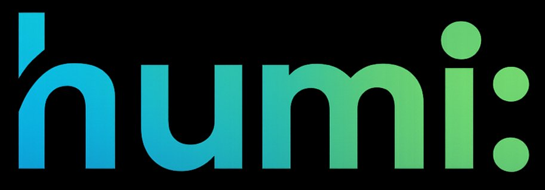
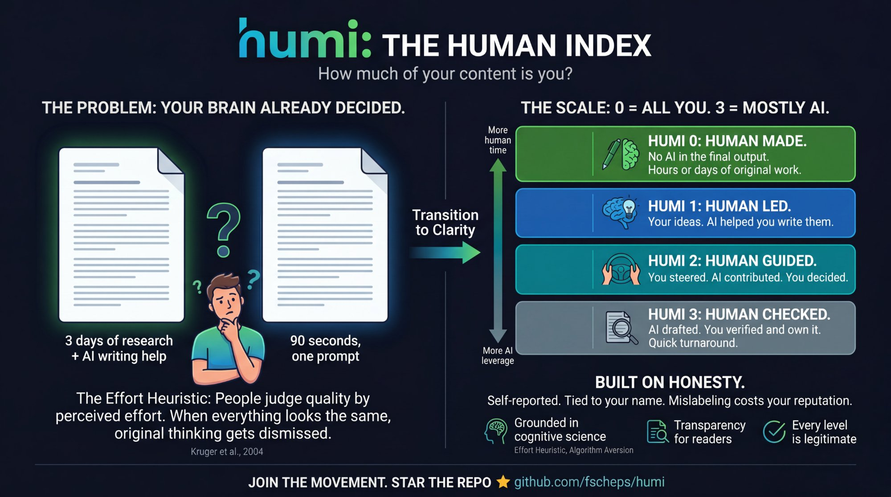

<p align="center">
  
</p>

<h3 align="center">The Human Index</h3>

<p align="center">
  <strong>An open standard that shows how much of your content is you.</strong>
</p>

<p align="center">
  <a href="#the-scale">The Scale</a> •
  <a href="#why-this-exists">Why This Exists</a> •
  <a href="#grab-your-badge">Grab Your Badge</a> •
  <a href="#the-science-behind-humi">The Science</a>
</p>

<p align="center">
  
  
  
</p>

---

## The Scale

**HUMI 0 = all you. HUMI 3 = mostly AI, but you stand behind it.**

The number measures how much AI was involved in creating the content. As the number goes up, the human role shifts from creator to reviewer.

<table>
  <tr>
    <td width="200" align="center">
      
    </td>
    <td>
      <strong>No AI in the final output.</strong><br>
      You researched, wrote, and produced this yourself. Hours or days of original work.<br>
      <em>Using AI for background research doesn't change this — only AI involvement in creating the content matters.</em>
    </td>
  </tr>
  <tr>
    <td width="200" align="center">
      
    </td>
    <td>
      <strong>Your ideas. AI helped you write them.</strong><br>
      You developed the thesis, framework, or argument. AI assisted with expression and refinement.<br>
      <em>The thinking is yours. The writing had help.</em>
    </td>
  </tr>
  <tr>
    <td width="200" align="center">
      
    </td>
    <td>
      <strong>You steered. AI contributed. You decided.</strong><br>
      AI proposed ideas or structure; you selected, shaped, and made the real decisions.<br>
      <em>More than a prompt — active collaboration.</em>
    </td>
  </tr>
  <tr>
    <td width="200" align="center">
      
    </td>
    <td>
      <strong>AI drafted it. You verified it and own it.</strong><br>
      Quick turnaround. You provided direction, reviewed for quality, and put your name on it.<br>
      <em>Fast, practical, accountable.</em>
    </td>
  </tr>
</table>

> **All four levels are legitimate.** A HUMI 3 product update doesn't need hours of research. A HUMI 0 essay represents a choice to create without AI. The point isn't judgment — it's clarity.

<p align="center">
  
</p>

---

## Why This Exists

You're scrolling through your feed. The writing is clean. But your brain already decided: *probably AI, probably not worth my time.*

This isn't just a feeling. It's a documented cognitive bias. People judge quality based on perceived effort ([Effort Heuristic](https://www.sciencedirect.com/science/article/abs/pii/S0022103603000659)), and content labeled as AI-generated gets rated [30%+ lower](https://arxiv.org/abs/2410.03723v2) than identical human-labeled content — even when readers can't tell the difference blind.

**The result:** someone who spent days developing original ideas and used AI to help express them gets the same dismissal as a 90-second prompt dump. The person who invested hours gets HUMI 0 or 1. The 90-second prompt gets HUMI 3. Both are valid — but readers can't tell which is which.

**HUMI fixes this.** A simple signal of effort. No judgment. Just transparency.

---

## Grab Your Badge

**Put HUMI at the top of your content.** Above the title, or right after it. Never at the bottom — by then, readers have already made their trust judgment.

### Ready-to-Copy Badges

Pick your level. Copy. Paste. Done.

#### For GitHub, Reddit, and Markdown

```markdown
[](https://github.com/Humi-Standard/humi)
```
```markdown
[](https://github.com/Humi-Standard/humi)
```
```markdown
[](https://github.com/Humi-Standard/humi)
```
```markdown
[](https://github.com/Humi-Standard/humi)
```

**Preview:**

[](https://github.com/Humi-Standard/humi) [](https://github.com/Humi-Standard/humi) [](https://github.com/Humi-Standard/humi) [](https://github.com/Humi-Standard/humi)

#### For WordPress, Ghost, HTML Blogs, and Newsletters

```html
<!-- HUMI 0 - Human Made -->
<a href="https://github.com/Humi-Standard/humi" target="_blank" rel="noopener" style="display:inline-flex;align-items:center;gap:10px;padding:10px 16px;background:#2E7D32;border-radius:8px;text-decoration:none;font-family:-apple-system,BlinkMacSystemFont,'Segoe UI',Roboto,sans-serif;box-shadow:0 2px 6px rgba(0,0,0,0.12);">
    <span style="font-size:13px;font-weight:700;color:white;">HUMI 0</span>
    <span style="width:1px;height:16px;background:rgba(255,255,255,0.3);"></span>
    <span style="font-size:13px;font-weight:500;color:white;">Human Made</span>
    <span style="font-size:12px;color:rgba(255,255,255,0.7);">↗</span>
</a>
```

```html
<!-- HUMI 1 - Human Led -->
<a href="https://github.com/Humi-Standard/humi" target="_blank" rel="noopener" style="display:inline-flex;align-items:center;gap:10px;padding:10px 16px;background:#1565C0;border-radius:8px;text-decoration:none;font-family:-apple-system,BlinkMacSystemFont,'Segoe UI',Roboto,sans-serif;box-shadow:0 2px 6px rgba(0,0,0,0.12);">
    <span style="font-size:13px;font-weight:700;color:white;">HUMI 1</span>
    <span style="width:1px;height:16px;background:rgba(255,255,255,0.3);"></span>
    <span style="font-size:13px;font-weight:500;color:white;">Human Led</span>
    <span style="font-size:12px;color:rgba(255,255,255,0.7);">↗</span>
</a>
```

```html
<!-- HUMI 2 - Human Guided -->
<a href="https://github.com/Humi-Standard/humi" target="_blank" rel="noopener" style="display:inline-flex;align-items:center;gap:10px;padding:10px 16px;background:#00838F;border-radius:8px;text-decoration:none;font-family:-apple-system,BlinkMacSystemFont,'Segoe UI',Roboto,sans-serif;box-shadow:0 2px 6px rgba(0,0,0,0.12);">
    <span style="font-size:13px;font-weight:700;color:white;">HUMI 2</span>
    <span style="width:1px;height:16px;background:rgba(255,255,255,0.3);"></span>
    <span style="font-size:13px;font-weight:500;color:white;">Human Guided</span>
    <span style="font-size:12px;color:rgba(255,255,255,0.7);">↗</span>
</a>
```

```html
<!-- HUMI 3 - Human Checked -->
<a href="https://github.com/Humi-Standard/humi" target="_blank" rel="noopener" style="display:inline-flex;align-items:center;gap:10px;padding:10px 16px;background:#607D8B;border-radius:8px;text-decoration:none;font-family:-apple-system,BlinkMacSystemFont,'Segoe UI',Roboto,sans-serif;box-shadow:0 2px 6px rgba(0,0,0,0.12);">
    <span style="font-size:13px;font-weight:700;color:white;">HUMI 3</span>
    <span style="width:1px;height:16px;background:rgba(255,255,255,0.3);"></span>
    <span style="font-size:13px;font-weight:500;color:white;">Human Checked</span>
    <span style="font-size:12px;color:rgba(255,255,255,0.7);">↗</span>
</a>
```

#### For LinkedIn, X (Twitter), and Social Media

These platforms don't support HTML. Use a text badge at the top of your post:

```
HUMI 0 · Human Made — No AI involved. Learn more: github.com/Humi-Standard/humi
```
```
HUMI 1 · Human Led — My ideas. AI helped me write them. Learn more: github.com/Humi-Standard/humi
```
```
HUMI 2 · Human Guided — I steered. AI contributed. I decided. Learn more: github.com/Humi-Standard/humi
```
```
HUMI 3 · Human Checked — AI drafted. I verified and own it. Learn more: github.com/Humi-Standard/humi
```

Or download a PNG badge from the **[Badge Generator](https://humi-standard.github.io/humi)** for a visual option.

### Want More Customization?

**→ [Open the Badge Generator](https://humi-standard.github.io/humi)** — pick from 7 themes (including minimal "Editorial" for clean blogs), choose alignment, toggle the link, and export as HTML, Markdown, text, or PNG/SVG.

---

## How It Works

### Honesty Is the Foundation

HUMI is self-reported. There's no verification mechanism, and that's intentional.

Think of it as a **chain of trust**. A HUMI badge from a stranger means little on its own. But from someone you kind-of trust? It solidifies that trust. HUMI amplifies existing reputation — it doesn't create it from scratch.

Mislabeling is reputationally costly. The badge is tied to your name. If you claim HUMI 1 and your readers sense slop, you've lost more than you gained. The value is in honest signaling.

### Why the Line at HUMI 3

HUMI requires human accountability. If no one reviewed it, refined it, and stands behind it, it doesn't get a HUMI badge. Content with zero human accountability is outside the standard.

### Choosing Your Level

Use this **litmus test**: *If you removed the AI entirely, would the primary argument still be yours?*

- **Yes, and I wrote it myself** → HUMI 0
- **Yes, but AI helped me express it** → HUMI 1
- **Partly — AI contributed to the substance, but I shaped it** → HUMI 2
- **No — AI drafted it, but I reviewed and own it** → HUMI 3

When in doubt, be conservative. The badge is a signal of good faith.

---

## Quick Reference

| Level | Name | Meaning |
|-------|------|---------|
| **HUMI 0** | Human Made | No AI involved. All you. |
| **HUMI 1** | Human Led | Your ideas. AI helped express them. |
| **HUMI 2** | Human Guided | You steered. AI contributed. You decided. |
| **HUMI 3** | Human Checked | AI drafted. You verified and own it. |

---

## FAQ

<details>
<summary><strong>Is HUMI 3 "bad"?</strong></summary>

No. HUMI 3 is honest and efficient. A product changelog doesn't need hours of original research. The point is clarity, not judgment.

</details>

<details>
<summary><strong>Is HUMI anti-AI?</strong></summary>

No. HUMI recognizes AI as a tool. All four levels are legitimate. The standard exists to signal effort, not to judge methods.

</details>

<details>
<summary><strong>Does using AI for research affect my level?</strong></summary>

No. HUMI measures AI involvement in *creating* the content, not researching it. Using Perplexity or Claude for research while writing everything yourself is still HUMI 0.

</details>

<details>
<summary><strong>Can I change my HUMI level after edits?</strong></summary>

Yes. If you substantially revise content, update the badge to reflect the new balance of effort.

</details>

<details>
<summary><strong>What stops people from lying?</strong></summary>

Nothing technical. HUMI is self-reported and trust-based — by design.

The badge is tied to your name. Mislabeling is reputationally costly. If you claim HUMI 1 and your readers sense slop, you've lost more than you gained. HUMI amplifies existing reputation — it doesn't create it from scratch.

</details>

---

## The Science Behind HUMI

HUMI is grounded in established cognitive science:

- **Effort Heuristic** — People use perceived effort as a shortcut to judge quality. More effort = higher perceived value, especially when quality is hard to assess. ([Kruger, Wirtz, Van Boven & Altermatt, 2004](https://www.sciencedirect.com/science/article/abs/pii/S0022103603000659))
- **Algorithm Aversion** — Content labeled as AI-generated is systematically devalued, even when identical to human-written content in blind tests. ([Kosch et al., 2025](https://arxiv.org/abs/2410.03723v2))
- **AI Authorship Effect** — When readers learn content was AI-generated, perceived competence of the author drops — even though content quality and willingness to follow the advice remain unchanged. ([Appel et al., 2023](https://www.nature.com/articles/s44271-023-00032-x))

These biases mean that creators who invest real effort but use AI as a tool get unfairly dismissed. HUMI provides the missing signal.

---

## Spread the Word

HUMI only works if people use it. Help us build the norm.

<p align="center">
  <a href="https://twitter.com/intent/tweet?text=HUMI%3A%20The%20Human%20Index%20%E2%80%94%20an%20open%20standard%20that%20shows%20how%20much%20of%20your%20content%20is%20you.%0A%0A0%20%3D%20all%20you.%203%20%3D%20mostly%20AI.%0AGrounded%20in%20cognitive%20science.%20Free%2C%20open%20source%2C%20CC0.%0A%0Agithub.com%2Ffscheps%2Fhumi">
    
  </a>&nbsp;
  <a href="https://www.linkedin.com/sharing/share-offsite/?url=https%3A%2F%2Fgithub.com%2Ffscheps%2Fhumi">
    
  </a>&nbsp;
  <a href="https://reddit.com/submit?url=https%3A%2F%2Fgithub.com%2Ffscheps%2Fhumi&title=HUMI%3A%20The%20Human%20Index%20%E2%80%94%20An%20open%20standard%20that%20shows%20how%20much%20of%20your%20content%20is%20you">
    
  </a>&nbsp;
  <a href="https://news.ycombinator.com/submitlink?u=https%3A%2F%2Fgithub.com%2Ffscheps%2Fhumi&t=HUMI%3A%20The%20Human%20Index%20%E2%80%94%20An%20open%20standard%20that%20shows%20how%20much%20of%20your%20content%20is%20you">
    
  </a>
</p>

**As a creator:** Start using HUMI on your content. Be honest. Place it at the top.

**As a reader:** Notice when creators use HUMI. Appreciate the transparency.

**As an advocate:** ⭐ Star this repo. Share with your community.

---

## License

**CC0 1.0 Universal (Public Domain)**

Use it, adapt it, build on it. No attribution required.

---

<p align="center">
  Created with ❤️ in 🇨🇭 Switzerland by <a href="https://x.com/fertech">Fernando Scheps</a>
</p>
